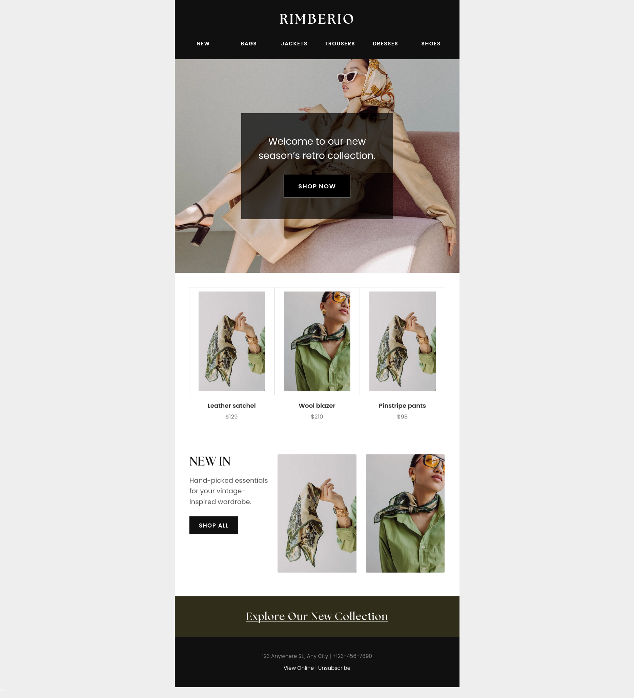
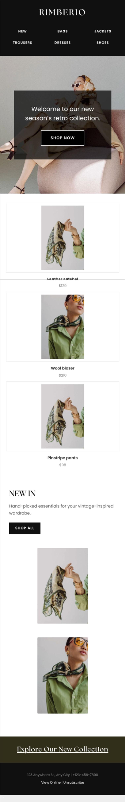

# 👗 Rimberio - Retail Apparel Lookbook
### A Responsive HTML Email Template with Dark Mode Optimization

| Desktop Preview | Mobile Preview |
| :--- | :--- |
|  |  |

## 📖 Project Overview
Modern email development must account for user system preferences, specifically the massive shift toward dark mode interfaces. Unoptimized emails often result in inverted colors, illegible text, and broken layouts when viewed in dark mode clients.

This repository showcases a **production-ready Retail Lookbook template**, designed for fashion and apparel brands. It utilizes a fluid-hybrid layout and is specifically engineered to respect user system preferences with full **Dark Mode support**, ensuring a seamless, luxury brand experience regardless of the user's inbox theme.

## 🛠️ Technical Implementation
To achieve maximum reliability and visual consistency, I implemented the following professional development standards:

* **Dark Mode Engineering:** Integrated `<meta name="color-scheme" content="light dark">` tags and `@media (prefers-color-scheme: dark)` CSS queries to safely swap background colors and text hex codes when dark mode is triggered by the email client (e.g., Apple Mail, iOS).
* **Fluid-Hybrid 3-Column Grid:** Engineered a complex 3-column product display utilizing `display: inline-block` containers (`.ghost-col`). This allows the product cards to sit side-by-side on desktop while smoothly transitioning to a stacked, full-width layout on mobile screens without relying on rigid media queries.
* **Hero Background Imagery:** Implemented a robust hero section utilizing background images with a solid `bgcolor` fallback to ensure the design degrades gracefully in clients that block external images (like Windows Outlook).
* **Web Typography Integration:** Integrated external web fonts (`Poppins` and `The Seasons`) to elevate the brand's aesthetic, backed by strict web-safe system font fallbacks (sans-serif and serif) to maintain layout integrity in unsupported clients.

## 🚀 Platform Integration
The modular codebase is highly adaptable and ready for immediate deployment in major CRM and Marketing Automation platforms, including:
* **Klaviyo**
* **Salesforce Marketing Cloud**
* **Mailchimp**
* **ActiveCampaign**

## 📂 Repository Structure
* `index.html`: The core production-ready HTML code.
* `preview.jpg`: Visual representation of the rendered desktop layout.
* `preview-mobile.jpg`: Visual representation of the rendered mobile layout.

## 🤝 Contact
**Salah Attar** *Email & Web Developer* | Focused on creating high-conversion, accessible, and technically robust digital experiences.
